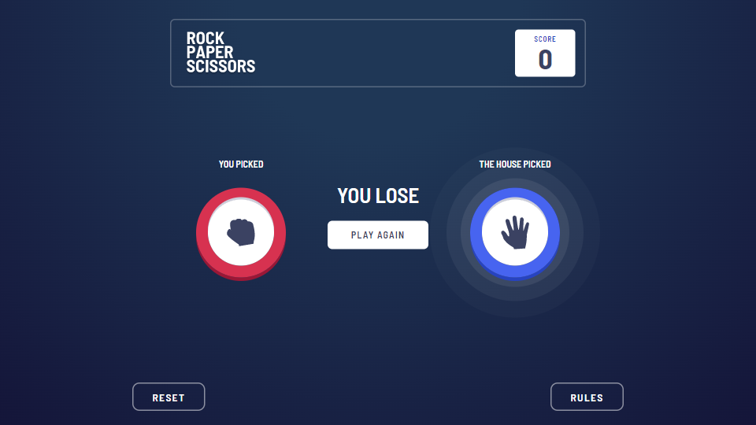

# Frontend Mentor - Rock, Paper, Scissors solution

This is a solution to the [Rock, Paper, Scissors challenge on Frontend Mentor](https://www.frontendmentor.io/challenges/rock-paper-scissors-game-pTgwgvgH). Frontend Mentor challenges help you improve your coding skills by building realistic projects.

## Table of contents

- [Overview](#overview)
  - [The challenge](#the-challenge)
  - [Screenshot](#screenshot)
  - [Links](#links)
- [My process](#my-process)
  - [Built with](#built-with)
  - [What I learned](#what-i-learned)
  - [Continued development](#continued-development)
  - [Useful resources](#useful-resources)
- [Author](#author)

## Overview

### The challenge

Users should be able to:

- View the optimal layout for the game depending on their device's screen size
- Play Rock, Paper, Scissors against the computer
- Maintain the state of the score after refreshing the browser _(optional)_
- **Bonus**: Play Rock, Paper, Scissors, Lizard, Spock against the computer _(optional)_

### Screenshot

### Links

- Solution URL: [GitHub](https://github.com/atharvpote/rock-paper-scissors)
- Live Site URL: [Rock, Paper, Scissors](https://fm-r-p-s.netlify.app/)

## My process

### Built with

- Semantic HTML5 markup
- Flexbox
- CSS Grid
- Mobile-first workflow
- [Typescript](https://www.typescriptlang.org/) - JavaScript With Syntax For Types
- [React](https://reactjs.org/) - JS Library
- [Tailwind CSS](https://tailwindcss.com/) - CSS Framework
- [Framer Motion](https://www.framer.com/motion/) - Animation Library
- [Vite](https://vitejs.dev/) - Build Tool

### What I learned

This is the first project I built using Typescript, Framer Motion and Vite

Typescript is great, the developer experience is awesome. I love how it prevent you from writing those annoying, subtle type related bugs where we expect data to be of one type but it's not. The tooltip you get with Typescript is just superior to Javascript. It's just awesome. Framer Motion is a good library, it get's the job done. The only gripe I have with it is documentation is not super great. Vite is awesome, it has solid templates and build time are super fast.

### Continued development

I will Typescript for my future project unless it's a very small one. The developer experience is just so good. I want to learn more about Framer Motion and animation in general, there are some effects and want to add in this project.

### Useful resources

- [MDN](https://developer.mozilla.org/)
- [Typescript Docs](https://www.typescriptlang.org/docs/)
- [React Docs](https://reactjs.org/docs/getting-started.html)
- [Tailwind Docs](https://tailwindcss.com/docs/)
- [Framer Motion Docs](https://www.framer.com/docs/)
- [Vite Docs](https://vitejs.dev/guide/)

## Author

- GitHub - [Atharv Pote](https://github.com/atharvpote/)
- Frontend Mentor - [@atharvpote](https://www.frontendmentor.io/profile/atharvpote)
